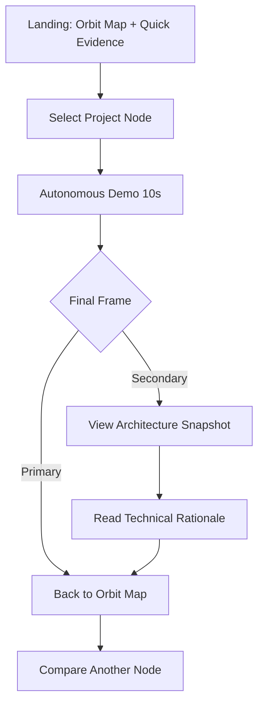
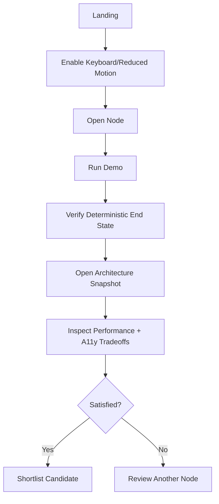
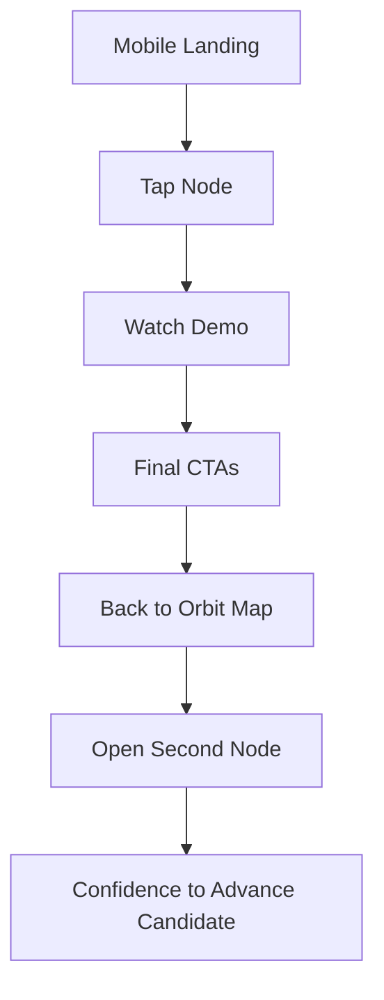
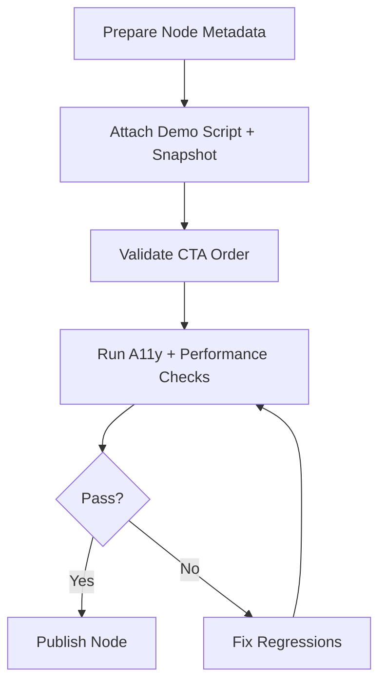

---
stepsCompleted:
  - 1
  - 2
  - 3
  - 4
  - 5
  - 6
  - 7
  - 8
  - 9
  - 10
  - 11
  - 12
  - 13
  - 14
lastStep: 14
workflowCompleted: true
inputDocuments:
  - /home/opsa/Work/Webdev/_bmad-output/planning-artifacts/prd.md
  - /home/opsa/Work/Webdev/_bmad-output/brainstorming/brainstorming-session-2026-03-01-100819.md
  - /home/opsa/Work/Webdev/_bmad-output/design-thinking-2026-03-01.md
---

# UX Design Specification Webdev

**Author:** Opsa  
**Date:** 2026-03-01

---

## Executive Summary

### Project Vision

Webdev is a personal portfolio site built around a Cosmic Archive world model where projects are discovered via orbit navigation instead of a linear list. The core UX goal is to make the work memorable without adding evaluator friction.

The site should reliably drive one repeatable proof loop for every featured project:

1. Enter orbit node
2. Watch deterministic 10-second autonomous demo
3. Land on non-looping final frame
4. Take explicit next action (`Back to Orbit Map` primary, `View Architecture Snapshot` secondary)

### Target Users

- Recruiters
  - Need fast capability signal and role fit in under 2 minutes.
  - Prefer clear labels, predictable paths, and low interaction overhead.
- Hiring managers
  - Need confidence that concept quality is matched by delivery discipline.
  - Value scope control, consistency, and clear outcomes.
- Senior engineers
  - Need explicit architecture rationale and tradeoff transparency.
  - Stress-test keyboard, reduced-motion, and reliability behavior.

### Key Design Challenges

- Preserve first-use orientation inside a non-standard orbit metaphor.
- Prevent style-over-substance perception by exposing proof artifacts early.
- Keep cinematic motion within strict performance budgets.
- Preserve accessibility parity across orbit navigation, demos, and deep-dive views.
- Keep authoring workflow repeatable so new nodes do not regress core UX quality.

### Design Opportunities

- Use dual-entry behavior (`Explore Orbit` + `Quick Evidence`) to satisfy both exploratory and time-constrained evaluators.
- Standardize a proof triad per node (autonomous demo, architecture snapshot, tradeoff rationale).
- Turn confidence × innovation from decoration into practical comparison signal.
- Use deterministic interaction contracts to increase evaluator trust.

## Core User Experience

### Defining Experience

The defining interaction is **orbit-first proof discovery**: users navigate a living constellation, select a node, consume deterministic proof, then return to orbit with orientation preserved.

### Platform Strategy

- Primary platform: responsive web app (desktop + mobile parity).
- Interaction models:
  - Desktop: mouse/keyboard-first, high information density tolerance.
  - Mobile: touch-first, reduced density, stronger progressive disclosure.
- Progressive enhancement:
  - Advanced motion and visual effects when supported.
  - Graceful fallback that preserves the proof loop and CTA order.

### Effortless Interactions

The following interactions must feel effortless:

- Selecting and entering any project node.
- Understanding what each node means before entering.
- Muting/unmuting ambient audio from any screen.
- Reaching architecture proof after demo completion.
- Returning to orbit map without losing context.

### Critical Success Moments

- **Orientation moment:** user understands how to evaluate projects within first 10-15 seconds.
- **Credibility moment:** autonomous demo completes deterministically and lands on clear next actions.
- **Depth moment:** architecture snapshot explains key tradeoffs without overload.
- **Control moment:** user discovers and uses comfort controls (audio/motion) in one interaction.

### Experience Principles

- Proof before polish: novelty can attract, but proof artifacts must close trust.
- Determinism builds confidence: core flows should behave consistently across runs.
- Orientation is persistent, not contextual: user should never wonder where they are.
- Primary path is explicit: every deep branch has an obvious return.
- Accessibility is first-class, not a retrofit.

## Desired Emotional Response

### Primary Emotional Goals

- Confidence: users feel the work is real and production-minded.
- Curiosity: users want to explore more nodes after one successful loop.
- Clarity: users never feel trapped or disoriented.

### Emotional Journey Mapping

- Landing: intrigued but grounded.
- Node entry: focused and guided.
- Demo playback: impressed, then informed.
- Final frame + CTAs: decisive, not uncertain.
- Architecture view: reassured by engineering judgment.
- Return to orbit: in control and ready to compare.

### Micro-Emotions

- Reinforce: confidence, momentum, accomplishment, trust.
- Avoid: confusion, skepticism, motion fatigue, cognitive overload.

### Design Implications

- Confidence -> explicit labeling, deterministic state transitions, clear CTA priority.
- Curiosity -> visible node variety, quick comparison signals, replayable demos.
- Clarity -> persistent location cues, predictable back path, concise content hierarchy.
- Calm -> optional ambient audio, reduced-motion support, stable visual rhythm.

### Emotional Design Principles

- Use cinematic moments sparingly and intentionally.
- Pair every expressive interaction with practical context.
- Keep progression obvious with status, progress, and completion signals.
- Prevent sensory overload through defaults that prioritize comfort.

## UX Pattern Analysis & Inspiration

### Inspiring Products Analysis

- Mission-control dashboards
  - Strong information hierarchy and status signaling.
  - Transfer: confidence/innovation comparability and orientation indicators.
- Planetarium-like navigation systems
  - Spatial memory improves recall when labels and anchors are stable.
  - Transfer: orbit map with persistent landmarks and mini-map support.
- High-clarity developer tooling UIs
  - Dense information can still feel usable when grouping and progressive disclosure are explicit.
  - Transfer: architecture snapshots with tabs and concise rationale bullets.

### Transferable UX Patterns

- Navigation patterns
  - Orbit map as primary IA plus persistent quick-evidence lane.
  - Fixed "back to map" semantics from all deep views.
- Interaction patterns
  - Deterministic autoplay sequence with visible progress and replay affordance.
  - Two-step decision frame after playback (return vs deep dive).
- Visual patterns
  - Semantic status rings (confidence x innovation) with tooltip/legend support.
  - High-contrast text overlays over atmospheric backgrounds.

### Anti-Patterns to Avoid

- Hidden controls for critical comfort features (audio, motion).
- Infinite demo loops that obscure completion and next action.
- Metaphor-heavy labels without plain-language interpretation.
- Deep branches without explicit return to orbit.
- Dense technical content shown before first proof completion.

### Design Inspiration Strategy

- Adopt
  - Deterministic proof sequence and explicit CTA framing.
  - Dashboard-grade signal clarity for comparison.
- Adapt
  - Planetarium-style spatial model, but with explicit product labels and role/stack/impact snippets.
  - Cinematic visual language with strict performance and reduced-motion variants.
- Avoid
  - Over-abstract narrative copy in primary evaluation paths.
  - Interaction novelty that needs tutorial-level explanation.

## Design System Foundation

### 1.1 Design System Choice

**Chosen approach:** Themeable system using **Tailwind CSS + Radix primitives + custom motion/visual layer**.

### Rationale for Selection

- Balances speed and uniqueness for a solo builder.
- Supports tokenized theming and accessible primitives without locking visuals to a generic style.
- Enables highly custom orbit and proof-theater components while reusing accessible base patterns for buttons, dialogs, tabs, and tooltips.

### Implementation Approach

- Use CSS custom properties as source-of-truth design tokens.
- Map tokens into Tailwind theme for utility-driven implementation.
- Build app primitives in layers:
  - Foundation: typography, spacing, color tokens.
  - System: button, chip, tag, panel, tab, tooltip.
  - Domain: orbit map, node card, proof theater, architecture snapshot.

### Customization Strategy

- Keep core primitives low-variance; push distinctiveness into domain components.
- Define strict state model contracts (idle, hover, focus, selected, loading, final-state).
- Use motion tokens (duration/ease/scale) with reduced-motion variants at token level.
- Apply per-component performance budgets (animation count, blur, media weight).

## 2. Core User Experience

### 2.1 Defining Experience

**"Explore -> Verify -> Decide"** is the canonical interaction arc.

- Explore via orbit map and confidence/innovation clues.
- Verify with deterministic autonomous demo.
- Decide with explicit post-demo CTAs and optional architecture depth.

### 2.2 User Mental Model

Users arrive expecting a portfolio list. The UX maps this expectation to orbit-based discovery using familiar evaluation outputs:

- Node = project summary entry point.
- Demo = evidence of implementation behavior.
- Snapshot = engineering rationale.
- Return CTA = guaranteed orientation reset.

### 2.3 Success Criteria

- First node opened within 15s desktop / 20s mobile.
- Demo completion + CTA action without hesitation.
- Architecture snapshot reached within <= 2 interactions from demo final frame.
- User can explain confidence/innovation meaning after one project.

### 2.4 Novel UX Patterns

- Confidence x Innovation ring system as a comparison aid.
- Autonomous proof theater with deterministic timeline and end-state freeze.
- Two-step exit frame with priority-preserving CTA hierarchy.

### 2.5 Experience Mechanics

- Initiation
  - Entry points: `Explore Orbit` and `Quick Evidence`.
  - Initial orbit map includes legend and persistent audio control.
- Interaction
  - Node select transitions into project panel.
  - User triggers demo, progress rail shows playback timeline.
- Feedback
  - During demo: status text + timeline progress.
  - End state: completed label, replay action, two CTAs.
- Completion
  - `Back to Orbit Map` restores prior selection context.
  - `View Architecture Snapshot` opens technical depth view with clear breadcrumb return.

## Visual Design Foundation

### Color System

Primary theme direction: **Deep Space Calm** with high-contrast utility overlays.

Core tokens (default theme):

- `--bg-0: #070B14`
- `--bg-1: #0E1630`
- `--surface-0: #121D3D`
- `--surface-1: #1A2A54`
- `--text-strong: #E9F1FF`
- `--text-muted: #9FB3D9`
- `--accent-primary: #62D0FF`
- `--accent-secondary: #7CFFB3`
- `--accent-warn: #FFD166`
- `--accent-danger: #FF6B6B`

Semantic mapping:

- Confidence signal: cyan-blue scale.
- Innovation signal: mint-green scale.
- Alerts/edge states: amber/red only for warnings/errors.

### Typography System

- Display/headline: `Space Grotesk` (expressive, technical, legible).
- UI/body: `IBM Plex Sans` (neutral, dense-content friendly).
- Code/meta labels: `JetBrains Mono`.

Type scale (desktop):

- `h1`: 56/64
- `h2`: 40/48
- `h3`: 28/36
- `h4`: 22/30
- `body-lg`: 18/28
- `body`: 16/24
- `caption`: 13/18

Type scale (mobile):

- `h1`: 34/42
- `h2`: 28/36
- `h3`: 22/30
- `body`: 16/24
- `caption`: 13/18

### Spacing & Layout Foundation

- Base unit: 8px.
- Radius scale: 8 / 12 / 16 / 24.
- Primary layout widths:
  - Content-max: 1200px.
  - Reading-max: 72ch.
- Grid:
  - Desktop: 12 columns.
  - Tablet: 8 columns.
  - Mobile: 4 columns.

Layout principles:

- Prioritize orientation and proof actions above decorative content.
- Keep primary CTA positions stable across views.
- Use progressive disclosure for deep technical sections.

### Accessibility Considerations

- Target WCAG 2.2 AA for all critical flows.
- Text contrast >= 4.5:1 for normal body text.
- Focus visible state must be persistent and high-contrast.
- Motion alternatives available for all timeline and orbit transitions.
- Audio state always visible; mute/unmute available globally.

## Design Direction Decision

### Design Directions Explored

Seven direction families were evaluated (documented in `ux-design-directions.html`):

1. Signal-First Command Deck
2. Minimal Orbit Editorial
3. Cinematic Proof Theater
4. Data-Grid Technical Atlas
5. Soft-Gradient Explorer
6. Dense Recruiter Fastlane
7. Hybrid Balance (recommended)

### Chosen Direction

**Hybrid Balance**

- Atmosphere of cinematic direction, but with signal clarity of command deck.
- Prioritizes quick-evidence access and deterministic proof mechanics.
- Uses expressive visuals in container/background layers, not core CTA/label layers.

### Design Rationale

- Most aligned with recruiter speed + engineer depth goals.
- Lowest risk of metaphor overload while preserving distinct identity.
- Strongest compatibility with performance and accessibility constraints.

### Implementation Approach

- Phase 1: build signal-first shell and proof flow.
- Phase 2: layer cinematic polish under strict budget thresholds.
- Phase 3: iterate on audience-mode and compare experience.

## User Journey Flows

### Recruiter Fast Qualification

Recruiter finds proof quickly, validates one project, and returns to map for comparison.

### Senior Engineer Deep Evaluation

Engineer validates determinism, accessibility, and architectural tradeoffs.

### Hiring Manager Mobile Review

Hiring manager completes proof loop quickly on mobile context.

### Owner Content Quality Gate

Owner updates node content with quality checks before publish.

### Journey Patterns

- All deep paths terminate in explicit return-to-orbit option.
- Proof sequence order is invariant across nodes.
- Technical depth is available but never blocks main proof loop.
- Mobile preserves the same semantics with denser progressive disclosure.

### Flow Optimization Principles

- Minimize steps-to-proof.
- Keep decisions binary where possible.
- Preserve continuity through breadcrumbs, mini-map, and stable CTA placement.
- Treat errors/retries as expected states with clear recovery.

## Component Strategy

### Design System Components

Use design-system primitives for:

- Buttons, icon buttons, tabs, dialogs, toasts, tooltips, badges, dropdowns.
- Focus ring, state tokens, and semantic status colors.
- Accessible keyboard patterns and ARIA defaults.

### Custom Components

#### OrbitMap

- Purpose: primary project discovery surface.
- Inputs: node metadata, confidence score, innovation score, status flags.
- States: loading, idle, hover, focus, selected, reduced-motion.
- Accessibility: roving tabindex, `aria-describedby` for node summaries, full keyboard node traversal.

#### ProjectNodePanel

- Purpose: contextual entry point to proof loop.
- Content: role, stack, impact, proof completeness indicators.
- Actions: start demo, open architecture snapshot, back to map.
- States: collapsed, expanded, active, error-fallback.

#### AutonomousProofPlayer

- Purpose: deterministic 10-second playback.
- Required behavior:
  - non-interactive timeline during playback,
  - visible progress rail,
  - non-looping final frame,
  - replay action,
  - stable CTA frame.
- Accessibility: announce state transitions via polite live region.

#### ArchitectureSnapshot

- Purpose: fast technical depth view.
- Tabs: System, Data, Performance, Accessibility.
- Required fields: decision, tradeoff, constraint, outcome.
- States: loading, loaded, missing-data fallback.

#### ConfidenceInnovationRing

- Purpose: visual comparison signal.
- Behavior: hover/focus reveals textual interpretation and scale legend.
- Accessibility: numeric + semantic label must always be available to screen readers.

#### AmbientAudioControl

- Purpose: site-wide comfort and brand control.
- Behavior: persistent position, one-tap mute/unmute, visible state.
- Persistence: session state retention across route changes.

#### QuickEvidenceRail

- Purpose: fast path to strongest proof artifacts.
- Behavior: sticky access from all major screens.
- Content: direct links to featured nodes and architecture highlights.

### Component Implementation Strategy

- Build custom components with token and primitive reuse.
- Keep domain components isolated in `components/domain/*`.
- Provide Storybook-style documentation for states and usage rules.
- Write interaction tests for CTA order, deterministic demo end state, and keyboard flow.

### Implementation Roadmap

- Phase 1 (critical)
  - OrbitMap
  - ProjectNodePanel
  - AutonomousProofPlayer
  - ArchitectureSnapshot
- Phase 2 (supporting)
  - ConfidenceInnovationRing
  - AmbientAudioControl
  - QuickEvidenceRail
- Phase 3 (enhancement)
  - Audience mode switcher
  - Compare mode module

## UX Consistency Patterns

### Button Hierarchy

- Primary button
  - Reserved for one highest-value next action per view.
  - In demo final frame, always `Back to Orbit Map`.
- Secondary button
  - Supports depth action without competing with primary.
  - In demo final frame, always `View Architecture Snapshot`.
- Tertiary/text button
  - Utility and low-risk actions only.

### Feedback Patterns

- Success: concise confirmation + optional next action.
- Error: plain-language issue + specific recovery action.
- Loading: skeleton or progress indicator with expected wait context.
- Completion: explicit done state and next-step CTA.

### Form Patterns

(For contact and owner workflow forms)

- Inline validation on blur + submit summary for unresolved issues.
- Error copy is actionable and field-specific.
- Preserve user input on validation failure.
- Minimum touch target 44x44 for all controls.

### Navigation Patterns

- Breadcrumb or mini-map visible in deep views.
- Back action semantics are deterministic and scope-aware.
- Quick-evidence access persists across major route transitions.
- Keyboard focus order follows visual reading order.

### Additional Patterns

- Empty states include suggested next action (usually return or explore).
- Motion states use shared easing/duration tokens.
- Tooltip content must be available by keyboard focus, not hover only.
- Any custom metaphor label includes plain-language companion text.

## Responsive Design & Accessibility

### Responsive Strategy

Desktop (>= 1024):

- Full orbit field with contextual side panels.
- Persistent quick-evidence rail.
- Higher information density in architecture snapshot tabs.

Tablet (768-1023):

- Orbit focus retained, side panels become bottom sheets or overlays.
- CTA grouping remains unchanged.

Mobile (<= 767):

- Orbit simplified for touch precision.
- Node details in stacked sheets with sticky action bar.
- Priority content only, deeper technical details collapsed by default.

### Breakpoint Strategy

- `sm`: 480px
- `md`: 768px
- `lg`: 1024px
- `xl`: 1280px
- `2xl`: 1536px

Approach: mobile-first with progressive enhancement.

### Accessibility Strategy

- Compliance target: WCAG 2.2 AA.
- Mandatory capabilities:
  - keyboard traversal across all critical flows,
  - visible focus states,
  - reduced-motion variants,
  - persistent audio controls,
  - semantic headings and ARIA landmarks.
- Contrast
  - body text >= 4.5:1,
  - large text >= 3:1,
  - non-text UI contrast >= 3:1.

### Testing Strategy

- Responsive
  - Test iOS Safari, Android Chrome, desktop Chrome/Firefox/Safari/Edge.
  - Validate layout, hit targets, and flow completion across device classes.
- Accessibility
  - Automated: axe/lighthouse scans in CI.
  - Manual: keyboard-only, VoiceOver/NVDA checks, reduced-motion checks.
- Behavioral
  - Validate deterministic demo start/end states.
  - Validate invariant CTA order across every node.

### Implementation Guidelines

- Use semantic HTML first; ARIA supplements only when needed.
- Keep animation on compositor-friendly properties where possible.
- Budget heavy effects (blur, shadow, particle counts) per viewport tier.
- Track UX KPIs:
  - time-to-first-node,
  - proof-loop completion rate,
  - architecture-snapshot open rate,
  - mute toggle discovery rate.

---

## Implementation Readiness Checklist

- [x] Core experience and proof loop defined.
- [x] CTA hierarchy specified and invariant.
- [x] Visual tokens and typography system defined.
- [x] Design direction selected with rationale.
- [x] Critical user journeys modeled with flows.
- [x] Component strategy and roadmap documented.
- [x] UX consistency patterns defined.
- [x] Responsive and accessibility strategy documented.
- [x] Required visual artifacts generated (`ux-color-themes.html`, `ux-design-directions.html`).
